# Blockchain

### Open a terminal window, navigate to the Blockchain-Tools folder and type the following command: "./puppeth"
### This should show the following prompt:
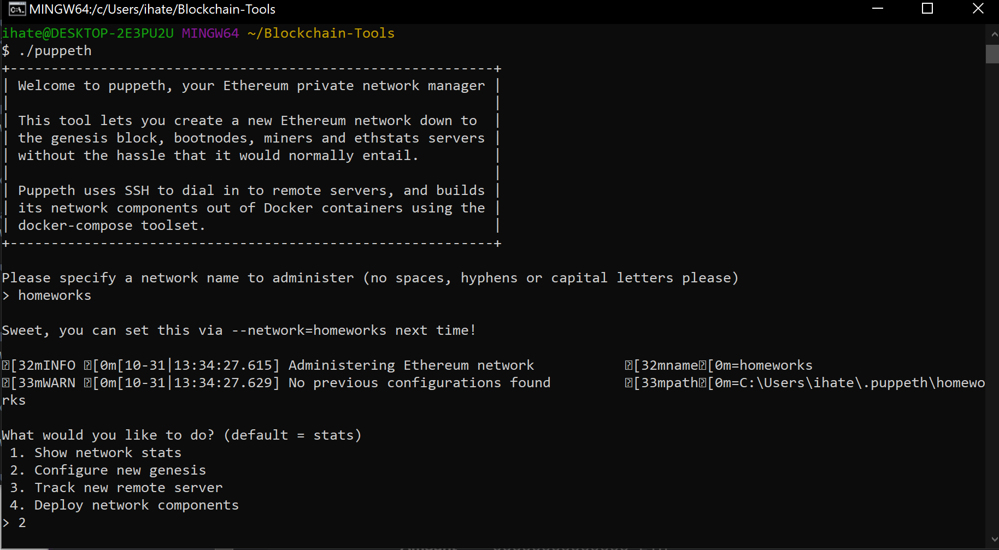

### Choose the Clique (Proof of Authority) consensus algorithm.
### Paste both account addresses from the first step one at a time into the list of accounts to seal.
### Paste them again in the list of accounts to pre-fund. There are no block rewards in PoA, so you'll need to pre-fund.
### You can choose no for pre-funding the pre-compiled accounts (0x1 .. 0xff) with wei. This keeps the genesis cleaner.
### Specify your Chain ID.
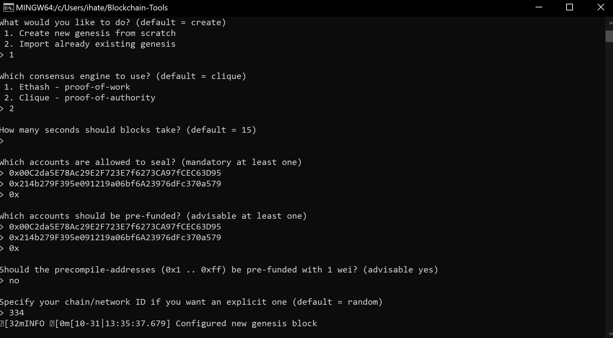

### Next Export your genesis configuration into a your networkname.json file as follows:
### In the puppeth prompt, navigate to the Manage existing genesis by typing 2 and hitting enter.
### You may have to type your network name again first if you're launching puppeth fresh.
### Then, type 2 again to choose the Export genesis configurations option, and continue with the default (current) directory by hitting enter: This will fail to create two of the files, but you only need "networkname.json".
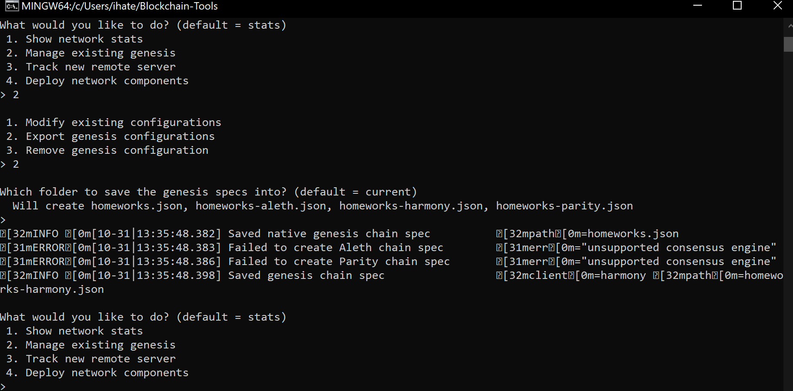

### Now, we need to create at least two nodes to build the chain from the genesis block onward:
### Exit puppeth by using the Ctrl+C keys combination.
### Create the first node's data directory using the geth command and a couple of command line flags by running the following line in your terminal window (Git Bash in Windows): "./geth account new --datadir node1"
### Then repeat the same process for the second node by replacing the datadir parameter with the node2 folder: "./geth account new --datadir node2"
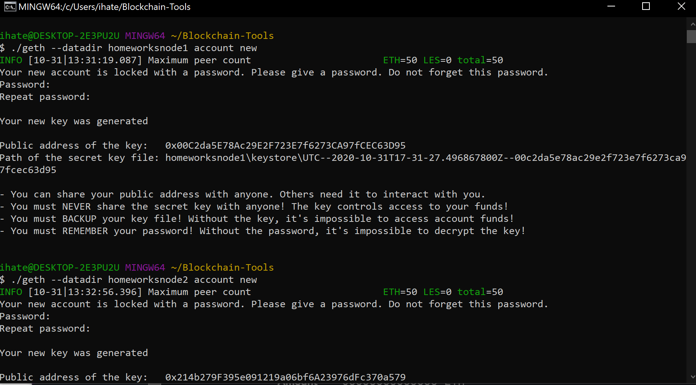

### Now, it's time to initialize and tell the nodes to use your genesis block!
### Initialize the first node, replacing yournetworkname.json with your own: "./geth init yournetworkname.json --datadir node1"
### Then run the same command for node2 : "./geth init yournetworkname.json --datadir node2"
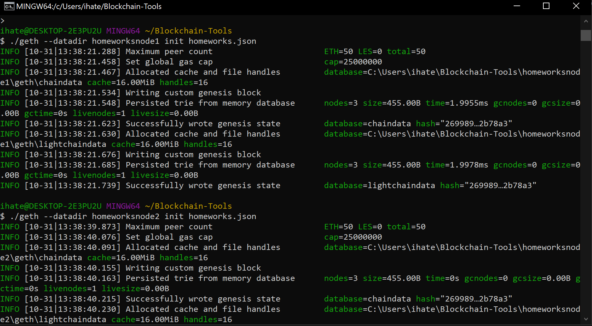

## Time to start your blockchain network! 
### Launch the first node into mining mode with the following command: "./geth --datadir node1 --mine --minerthreads 1"
### The --mine flag tells the node to mine new blocks.
### The --minerthreads flag tells geth how many CPU threads, or "workers" to use during mining. Since our difficulty is low, we can set it to 1.
### You should see the node Committing new mining work:
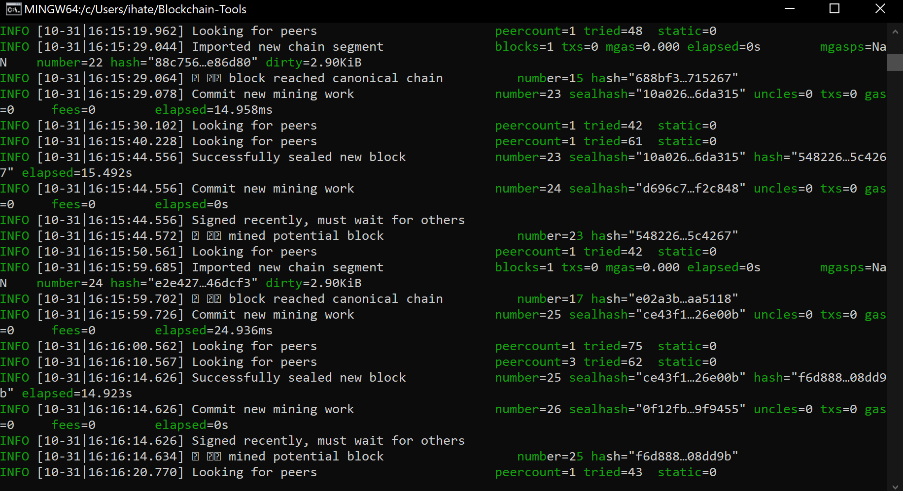 

## Now you will launch the second node and configure it to let us talk to the chain via RPC.
### Scroll up in the terminal window where node1 is running, and copy the entire enode:// address (including the last @address:port segment) of the first node located in the Started P2P Networking line.
### Open another terminal window and navigate to the same directory as before.
### Launch the second node, enable RPC, change the sync port, and pass the enode:// address of the first node in quotes by running the following command: "./geth --datadir node2 --port 30304 --rpc --bootnodes "enode://<replace with node1 enode address>" --ipcdisable"
### Be sure to unlock the account and enable mining on the second node!
### The output of the second node should show information about Importing block segments and synchronization:
### You should now see both nodes producing new blocks, congratulations!
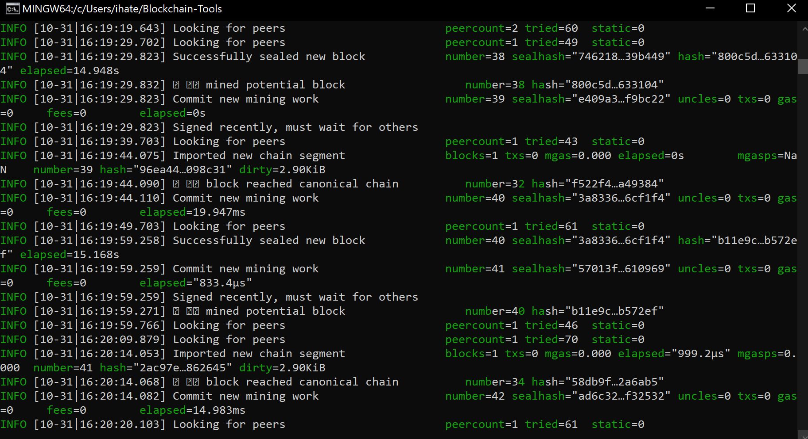

## Send a test transaction
### Use the MyCrypto GUI wallet to connect to the node with the exposed RPC port.
### You will need to use a custom network, and include the chain ID, and use ETH as the currency.
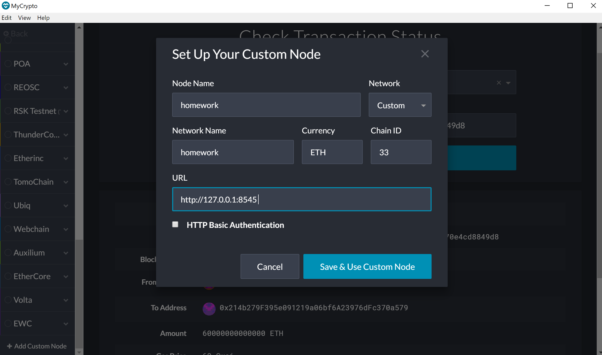
## Now you are going to connect MyCrypto with the blockchain you created. Follow the next steps.
### Open up MyCrypto, then click Change Network at the bottom left:
### Click "Add Custom Node", then add the custom network information that you set in the genesis.
### Make sure that you scroll down to choose Custom in the "Network" column to reveal more options like Chain ID:
### The chain ID must match what you came up with earlier.
### The URL is pointing to the default RPC port on your local machine. Use http://127.0.0.1:8545.
### Once you save and use the network, double-check that it is selected and is connected.
### Now that you are connected to your blockchain, you will need to load a private key that you created and funded on the network:
### On the left pane menu, click on "View & Send".
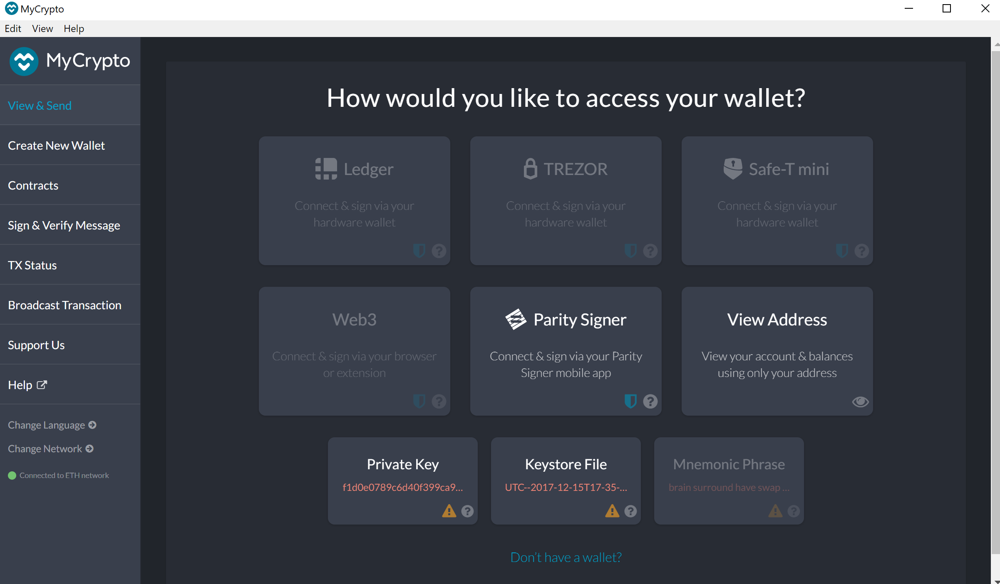

### Import the keystore file from the node1/keystore directory into MyCrypto. This will import the private key.
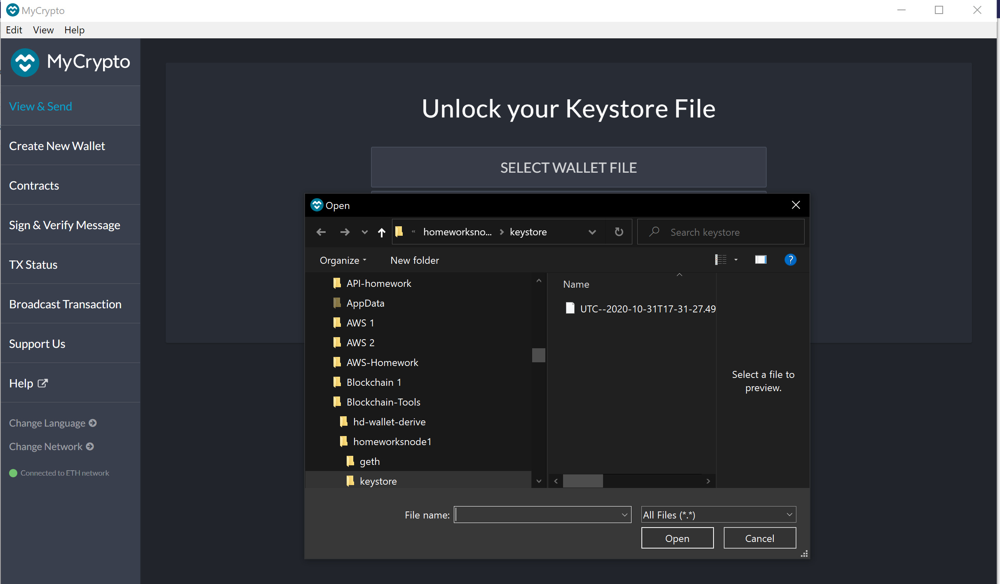

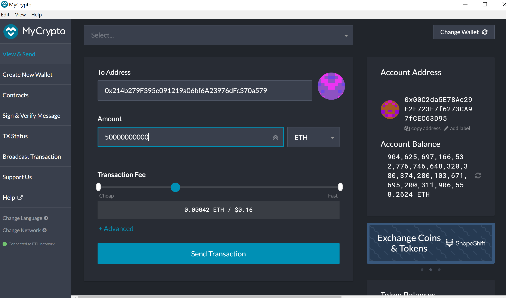
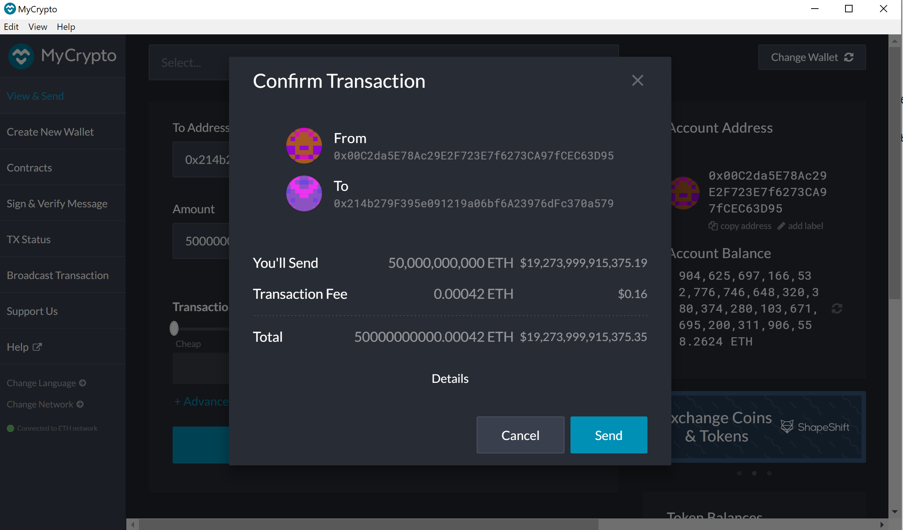
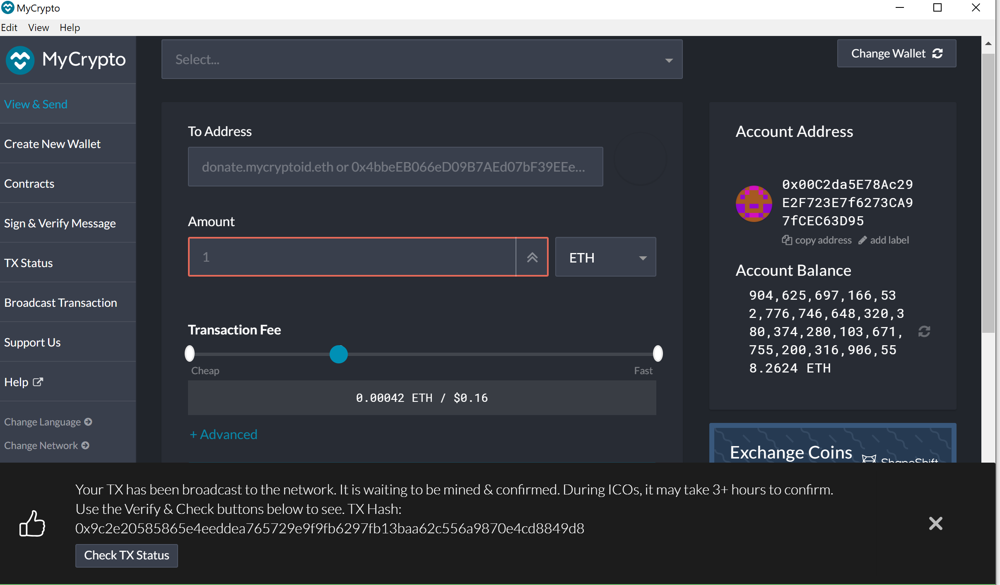
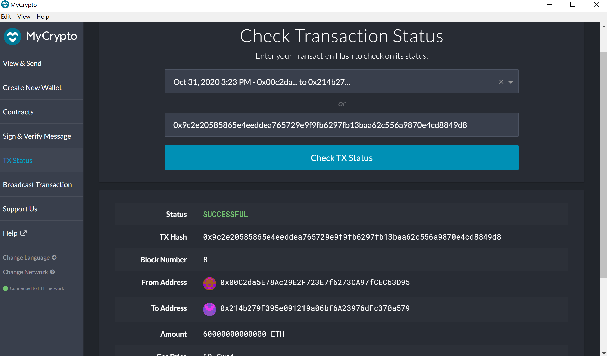
